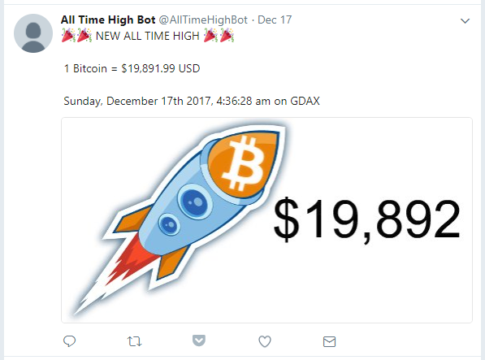

# Bitcoin All-Time-High

Source Code for [@AllTimeHighBot](https://twitter.com/AllTimeHighBot).

Example:



## Configuration

Modify the following settings in `config/default.yml` or create a new `local.yml`. `local.yml` will not be checked into GIT.

Twitter API Keys: [https://apps.twitter.com](https://apps.twitter.com)

GDAX API Keys: [https://support.gdax.com/customer/en/portal/articles/2425383-how-can-i-create-an-api-key-for-gdax-](https://support.gdax.com/customer/en/portal/articles/2425383-how-can-i-create-an-api-key-for-gdax-)

```yaml
---
twitter:
  consumer_key:
  consumer_secret:
  access_token:
  access_token_secret:
gdax:
  key:
  secret:
  passphrase:
```

## Production Install

### Running as a shell script

```bash
# install dependencies
npm install

# build project
npm run dist

# run forever
npm run forever
```

### Installing as a service

```bash
# install dependencies
npm install

# build project
npm run dist

# install forever-service
sudo npm install -g forever-service

# install service
sudo forever-service install all-time-high -s dist/index.js
```

### Start the service

```bash
sudo service all-time-high start
```

### Stop the service

```bash
sudo service all-time-high stop
sudo npx forever stop all-time-high
```

### Status

```bash
# list status of all services
service --status-all

# list all forever services running
sudo npx forever list
```

If tracker is running you can watch live price updates

```bash
tail -f .data/tracker-<year>-<month>-<day>.csv
```

## Licenses

* Rocket - https://pixabay.com/en/rocket-spaceship-clip-art-clipart-2841765/
